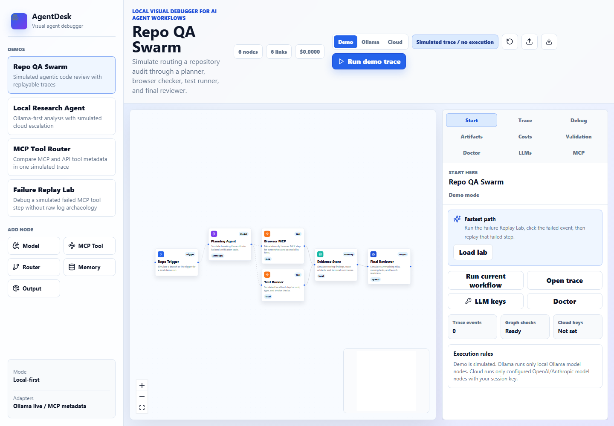
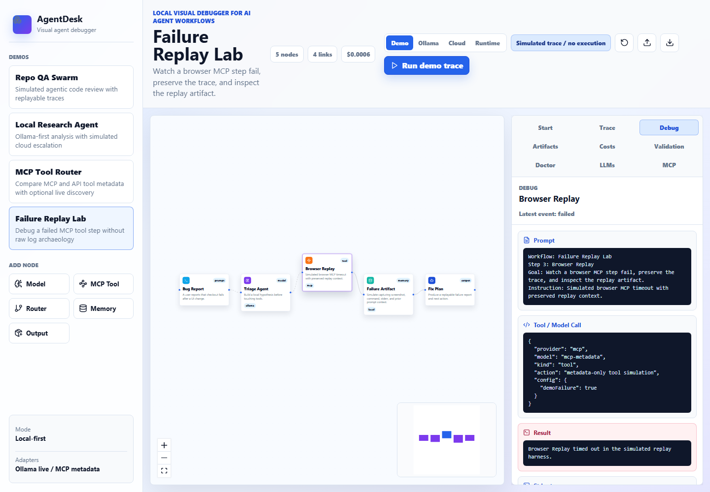
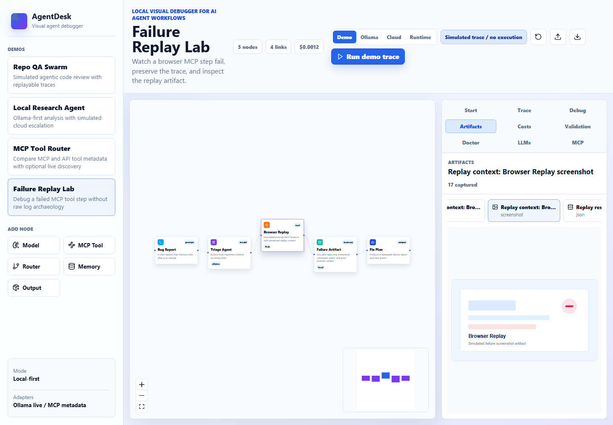
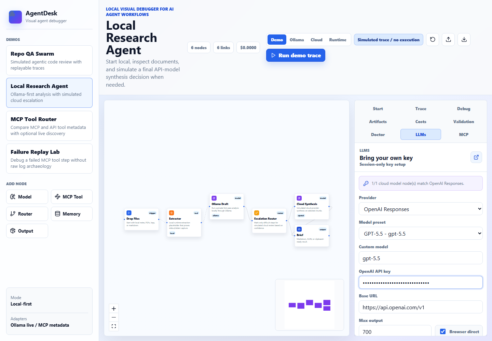

# AgentDesk

**A local visual debugger for AI agent runs: replay the failure, inspect every prompt/tool/result, and export redacted evidence before you wire in live tools.**

[](https://github.com/karurikwao/agentdesk/actions/workflows/ci.yml)
[](./LICENSE)
[](./package.json)

AgentDesk answers the 10-second question: **what actually happened inside this agent run, and can I replay or share the evidence?**

- Replay a failed agent run instead of reading raw logs.
- Click from trace event to graph node and inspect prompt/tool/result/artifacts.
- Export a redacted replay session you can share in an issue, PR, or handoff.

[Live demo](https://agentdesk-clf.pages.dev/) | [Launch page](https://karurikwao.github.io/agentdesk/) | [GitHub repo](https://github.com/karurikwao/agentdesk)



## Why It Exists

Most workflow builders optimize for wiring boxes together and shipping automation. AgentDesk optimizes for the debugging loop before that: replay a run, click from trace to graph, inspect the exact prompt/tool/result payloads, review artifacts and cost, check graph health, and export redacted evidence.

Use it when you need to explain or reproduce an agent run locally. Use a workflow builder when you need production scheduling, hosted secrets, queues, branching operations, or live third-party tool execution.

| Need | Use |
| --- | --- |
| Replay and explain a failed local agent run | AgentDesk |
| Production scheduling, queues, hosted secrets, and cron jobs | Workflow builders |
| Hosted tracing/evals across deployed applications | Observability platforms |
| Framework-specific authoring and debugging | Framework studios |

## Why Star This Repo

- It is a debugger-first agent tool, not another orchestration canvas.
- It gives immediate value in Demo mode without accounts, keys, or hosted infrastructure.
- It can graduate from demo evidence to live local execution through Ollama, BYOK model nodes, and loopback Runtime mode.
- It treats safety as a product feature: explicit execution modes, local runtime boundaries, secret redaction, and exportable evidence.
- It is small enough to understand, fork, and adapt for a team’s own agent runtime.

## Launch Install Paths

The npm package name `agentdesk` is currently available but unpublished. Until the npm publish step happens, use the source install:

```bash
git clone https://github.com/karurikwao/agentdesk.git
cd agentdesk
npm install
npm run dev
```

For the packaged local runtime:

```bash
npm run build
node ./bin/agentdesk.mjs --port 5173
```

After npm publish, the intended quick path is:

```bash
npx agentdesk --port 5173
```

## 10-Second Demo

1. Open the `Start` tab and click `Load lab`.
2. Click `Run demo trace`.
3. Click the failed event to highlight its node and inspect prompt/tool/result.
4. Click `Replay failed step`.
5. Open `Artifacts`, `Costs`, `Validation`, `Doctor`, and `LLMs`, then export the `.agentdesk-session.json` replay session.

## What Works Today

- Visual workflow canvas with four launch demos: Repo QA Swarm, Local Research Agent, MCP Tool Router, and Failure Replay Lab.
- Demo trace runner with active-node highlighting, trace-to-node selection, node-to-latest-event inspection, graph validation, cost/token summaries, simulated failures, whole-run replay, and failed-step replay.
- Debugger inspector tabs for Start, Trace, Debug, Artifacts, Costs, Validation, Doctor, LLMs, and MCP import.
- Artifact viewer for JSON, markdown, simulated screenshot SVG previews, stdout, and stderr captured from trace events.
- Graph health UI for cycles, missing endpoints, duplicate IDs, missing edges, unreachable outputs, and non-output dead ends.
- Live local Ollama mode for `provider: "ollama"` model nodes.
- Cloud BYOK mode for configured `provider: "openai"` and `provider: "anthropic"` model nodes, with API keys held in browser session state only.
- Runtime mode through the packaged loopback CLI for local command nodes, MCP 2025-11-25 stdio initialize/paginated tools-list/call-tool, and remote Streamable HTTP probing.
- Provider/model dropdown presets for OpenAI Responses and Anthropic Messages, plus editable base URL and model fields.
- MCP config import for Claude-style `mcpServers`, VS Code-style `servers`, nested `mcp.servers`, remote server URLs, and single-server JSON.
- MCP readiness, risk flags, inferred/live tool hints, and env/header key names without secret values.
- Replay-session import/export with `portableWorkflow`, `traceSummary`, trace bundle manifest, LangGraph/CrewAI starter exports, full trace data, artifacts, costs, validation issues, selected evidence, imported MCP metadata, and secret/path redaction.
- Packaged static CLI via `agentdesk` after `npm run build`.

Static hosted demos do not execute local processes. Live local command and MCP execution is available only when you run the packaged CLI on loopback and switch to `Runtime` mode.

## Screenshots

| Failure Debugger | Artifacts | BYOK LLMs |
| --- | --- | --- |
|  |  |  |

## Quick Start

Prerequisite: Node.js 20.19.0 or newer.

```bash
npm install
npm run dev
```

Open `http://127.0.0.1:5173`.

The app opens on `Start`, which gives the shortest path into the Failure Replay Lab, trace inspector, Doctor, and LLM key setup.

### Guided Demo

1. Start on the `Start` tab and click `Load lab`.
2. Click `Run demo trace`.
3. Click the failed `Browser Replay` trace event to highlight its node and inspect prompt/tool/result.
4. Click `Replay failed step`, then open `Artifacts` and `Costs`.
5. Use `LLM keys` or `Doctor` from `Start` when you want setup checks.
6. Paste an example MCP config from [`docs/examples`](./docs/examples).
7. Export the `.agentdesk-session.json` replay session and import it again to restore the evidence.

### Optional Local Ollama Run

1. Start Ollama locally on `127.0.0.1:11434`.
2. Pull the demo model, for example `ollama pull llama3.2`.
3. Pick `Local Research Agent`.
4. Switch run mode from `Demo` to `Ollama`.
5. Click `Run local Ollama`.

Only Ollama model nodes are executed. All MCP and local tool nodes remain simulated metadata steps.
Cloud-provider model nodes remain simulated too, with trace entries marked as simulated during Ollama mode.

### Optional Cloud BYOK Run

1. Pick `Local Research Agent` for the OpenAI path (`Cloud Synthesis`) or `Repo QA Swarm` for an Anthropic planning path.
2. Open the `LLMs` tab.
3. Pick `OpenAI Responses` for `Local Research Agent` or `Anthropic Messages` for Anthropic model nodes.
4. Choose a model preset or type a custom model ID.
5. Paste your API key, then click `Use Cloud mode`.
6. Click `Apply to nodes` if you want matching model nodes updated to the selected model.
7. Click `Run BYOK cloud`.

Only configured OpenAI/Anthropic model nodes execute in Cloud mode. API keys stay in this browser tab's React state and are not saved to localStorage, replay sessions, workflow exports, or debug payloads. Cloud BYOK calls are browser-direct: provider CORS, browser policy, or organization settings may block direct requests, and production apps should use a backend proxy or hosted secret boundary.

### Optional Runtime Mode

1. Build and start the packaged CLI:

```bash
npm run build
node ./bin/agentdesk.mjs --port 5173
```

2. Open `http://127.0.0.1:5173`.
3. Click `Doctor`, then `Check runtime`.
4. Switch run mode to `Runtime`.
5. Run workflows with configured `provider: "local"` command nodes, or import an MCP config and click `Discover` on an MCP server.

Runtime mode uses loopback-only API routes, JSON-only requests, no shell by default, fixed timeouts, stdout/stderr caps, and redacted trace artifacts. MCP stdio servers are initialized through JSON-RPC, paginated `tools/list` results are captured as evidence, and `tools/call` is available when a node supplies `toolName` and optional `toolInputJson` in config. AgentDesk negotiates MCP protocol version `2025-11-25`, preserves discovered tool descriptor metadata such as `outputSchema` and `execution`, and treats `isError: true` tool-call results as failed trace events. Remote MCP Streamable HTTP endpoints are probed only after explicit discovery.

## MCP Import Examples

- [`docs/examples/mcp-claude-desktop.json`](./docs/examples/mcp-claude-desktop.json)
- [`docs/examples/mcp-vscode.json`](./docs/examples/mcp-vscode.json)

Secrets in env values, headers, URLs, args, private user path prefixes, and common token formats are redacted before display/export.

## Scripts

```bash
npm run dev        # start local Vite app on 127.0.0.1:5173
npm run build      # typecheck and build
npm run preview    # preview production build
npm run test       # run unit tests
npm run test:e2e:install # install Playwright Chromium
npm run test:e2e   # build and run browser regressions
npm run check:release # verify launch/release docs and version metadata
npm run screenshots:launch # refresh GitHub Pages launch screenshots
npm run smoke:package # pack, install, and serve the CLI in a clean temp project
npm run lint       # run TypeScript checks
npm run verify     # typecheck, test, build, audit
npm pack --dry-run # verify package contents
```

## Packaged CLI

```bash
npm run build
node ./bin/agentdesk.mjs --port 5173
```

The CLI serves the built `dist` app from localhost with conservative static-server headers.

## Current Limits

- Ollama calls happen from the browser to `127.0.0.1:11434`; CORS settings may need adjustment in some local Ollama setups.
- Cloud BYOK calls happen directly from the browser tab; provider CORS may block some endpoints, and production apps should use a backend proxy or hosted secret boundary instead.
- Runtime mode requires the packaged CLI; static Cloudflare and GitHub Pages builds cannot spawn local processes.
- Shell commands are blocked unless `AGENTDESK_ALLOW_SHELL=1` is set before starting the CLI.
- BYOK prompts and responses become trace/debug/artifact evidence, even though API keys are excluded from exports.
- Workflow execution is still linear/topological; advanced branching and joins are schema-ready but not fully interactive.
- Project storage is replay-session import/export only for now; there is no persistent workspace database.
- The README uses a current screenshot; an optional short GIF can replace it in a later promo pass.

## Roadmap

- Official MCP SDK transport adapter on top of the current JSON-RPC runtime.
- Persistent workspace profiles for approved MCP configs and local command adapters.
- Zip export for the current trace bundle manifest.
- Launch video and GIF for the README hero.

## Launch Assets

- Release notes: [`docs/RELEASE_v0.6.1.md`](./docs/RELEASE_v0.6.1.md)
- Good first issues: [`docs/GOOD_FIRST_ISSUES.md`](./docs/GOOD_FIRST_ISSUES.md)
- Launch details: [`docs/PROJECT_LAUNCH.md`](./docs/PROJECT_LAUNCH.md)
- Launch plan: [`docs/LAUNCH_PLAN.md`](./docs/LAUNCH_PLAN.md)

## Security Notes

AgentDesk treats imported MCP configs and replay sessions as untrusted. Runtime mode can execute local commands and MCP servers only through the loopback CLI after explicit UI action. Exports redact common secrets and private paths, but local UI display is not a secret vault. BYOK API keys are session-only and excluded from replay exports, but direct browser calls still expose the supplied key to the local tab runtime and provider endpoint. Do not paste real secrets into node labels, prompts, stdout/stderr, artifacts, screenshots, or model responses. See [SECURITY.md](./SECURITY.md).

## License

MIT
