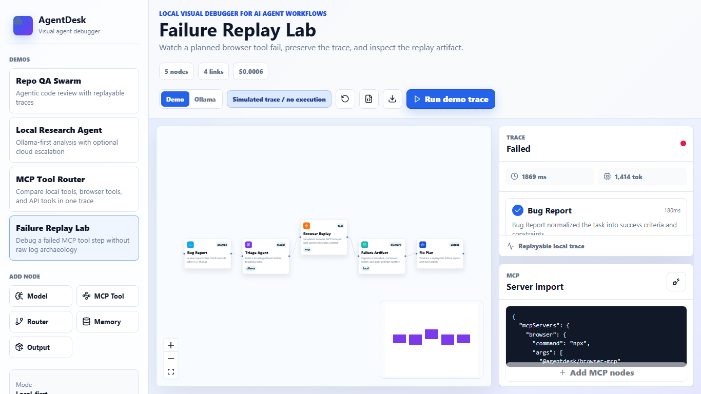

# AgentDesk

**A local visual debugger for AI agent workflows across MCP tools, local models, and simulated cloud-provider steps.**

[](#scripts)
[](./LICENSE)
[](./package.json)

AgentDesk gives developers a graph canvas, replayable traces, MCP config import, safe redaction, local Ollama execution, simulated OpenAI/Anthropic-style steps, and portable workflow exports. It is built for the moment when you ask: what actually happened inside this agent run?

[Live demo](https://agentdesk-clf.pages.dev/) · [Cloudflare deployment](https://6a3a1ae4.agentdesk-clf.pages.dev/) · [GitHub repo](https://github.com/karurikwao/agentdesk)



## Why Star AgentDesk?

Star AgentDesk if you want a local-first, inspectable way to design and debug agent workflows before giving them real tool execution. It is not trying to be another giant workflow platform. The wedge is visual debugging: graph, trace, prompt/tool previews, simulated failure traces, cost/tokens, and exportable evidence in one place.

## What Works Today

- Visual workflow canvas with four launch demos: Repo QA Swarm, Local Research Agent, MCP Tool Router, and Failure Replay Lab.
- Demo trace runner with active-node highlighting, graph validation, output previews, cost/token summaries, simulated failures, and whole-run replay.
- Live local Ollama mode for `provider: "ollama"` model nodes only.
- MCP config import for Claude-style `mcpServers`, VS Code-style `servers`, nested `mcp.servers`, remote server URLs, and single-server JSON.
- MCP metadata readiness, risk flags, inferred tool hints, and env/header key names without secret values.
- JSON export with `portableWorkflow`, `traceSummary`, full trace data, and secret/path redaction.
- Packaged static CLI via `agentdesk` after `npm run build`.

Imported MCP commands are **metadata-only** in this release. AgentDesk does not execute MCP stdio commands or probe remote MCP URLs automatically.
OpenAI, Anthropic, and other cloud-provider nodes are simulated in this release; live execution is limited to local Ollama model nodes.

## Quick Start

Prerequisite: Node.js 20 or newer.

```bash
npm install
npm run dev
```

Open `http://127.0.0.1:5173`.

### 30-Second Demo

1. Pick `Failure Replay Lab`.
2. Click `Run demo trace`.
3. Inspect the failed browser step in the trace panel.
4. Paste an example MCP config from [`docs/examples`](./docs/examples).
5. Export the `.agentdesk.json` trace.

### Optional Local Ollama Run

1. Start Ollama locally on `127.0.0.1:11434`.
2. Pull the demo model, for example `ollama pull llama3.2`.
3. Pick `Local Research Agent`.
4. Switch run mode from `Demo` to `Ollama`.
5. Click `Run local Ollama`.

Only Ollama model nodes are executed. All MCP and local tool nodes remain simulated metadata steps.
Cloud-provider model nodes remain simulated too, with trace entries marked as simulated during Ollama mode.

## MCP Import Examples

- [`docs/examples/mcp-claude-desktop.json`](./docs/examples/mcp-claude-desktop.json)
- [`docs/examples/mcp-vscode.json`](./docs/examples/mcp-vscode.json)

Secrets in env values, headers, URLs, args, private user path prefixes, and common token formats are redacted before display/export.

## Scripts

```bash
npm run dev        # start local Vite app on 127.0.0.1:5173
npm run build      # typecheck and build
npm run preview    # preview production build
npm run test       # run unit tests
npm run lint       # run TypeScript checks
npm run verify     # typecheck, test, build, audit
npm pack --dry-run # verify package contents
```

## Packaged CLI

```bash
npm run build
node ./bin/agentdesk.mjs --port 5173
```

The CLI serves the built `dist` app from localhost with conservative static-server headers.

## Current Limits

- MCP command execution and true MCP tool discovery are intentionally not enabled yet.
- Ollama calls happen from the browser to `127.0.0.1:11434`; CORS settings may need adjustment in some local Ollama setups.
- Workflow execution is still linear/topological; advanced branching and joins are schema-ready but not fully interactive.
- Project storage is export-only for now; there is no persistent workspace database.
- The README currently uses a screenshot; a short GIF should be recorded before a public launch push.

## Roadmap

- Approval-gated Node-side MCP runner using the official MCP SDK.
- Real MCP initialize/list-tools discovery with timeout and process cleanup.
- Shareable trace bundle with screenshots and stdout/stderr artifacts.
- LangGraph/CrewAI export adapters.
- Hosted docs site and launch video.

## Security Notes

AgentDesk treats imported MCP configs as untrusted metadata. Do not paste real secrets into node labels or descriptions. See [SECURITY.md](./SECURITY.md).

## License

MIT
